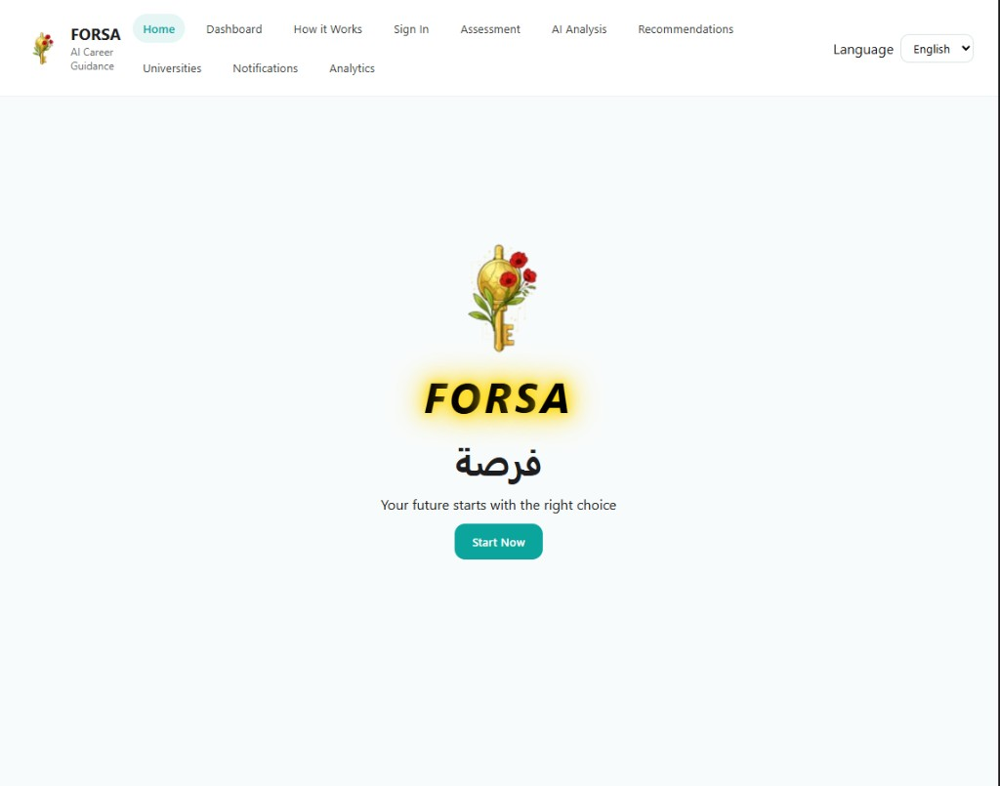
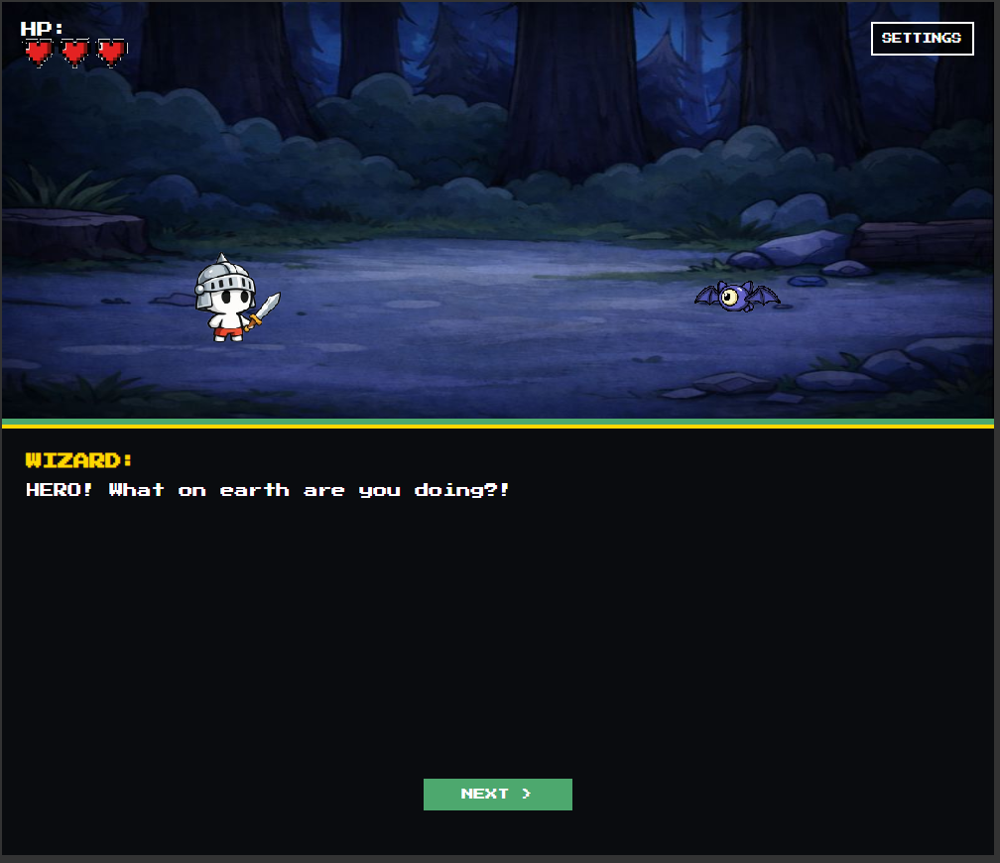

# FORSA

FORSA is a web-based career guidance platform that helps students explore academic paths through guided assessment, contextual recommendations, university discovery, and an interactive learning experience.

## Overview
Many students choose majors without enough personalized guidance. FORSA addresses this by combining interest signals, personal readiness indicators, contextual constraints, and grounded educational data to present more thoughtful recommendations.

## Key Features
- Guided onboarding and assessment flow
- Career recommendation engine with explainable reasoning
- University and workshop discovery experience
- Notifications and analytics views
- Bilingual interface in English and Arabic
- Interactive game experience connected to the platform journey

## Screenshots

### Main Experience


### Interactive Game


## How It Works
FORSA uses a structured recommendation flow built around:
- Interest assessment results
- Psycho-cognitive indicators such as stress, focus, resilience, and social tolerance
- Environmental constraints such as internet access, location stability, and crisis exposure
- Retrieved contextual information about university programs, workshops, and labor market signals

The current prototype keeps the recommendation logic deterministic to make outputs easier to inspect and explain.

## Project Structure
- `index.html` - main application entry point
- `app.js` - state management, recommendation logic, retrieval helpers, rendering, and navigation
- `styles.css` - shared interface styling
- `game.html` - standalone game experience
- `assets/` - shared logos, illustrations, and interface assets
- `assets/game/` - organized game-specific backgrounds, characters, and UI images
- `docs/screenshots/` - repository screenshots used in the documentation

## Running Locally
No build step is required.

1. Open `index.html` directly in a browser, or
2. Start a simple local server:

```bash
python -m http.server 8000
```

Then open `http://127.0.0.1:8000/`.
